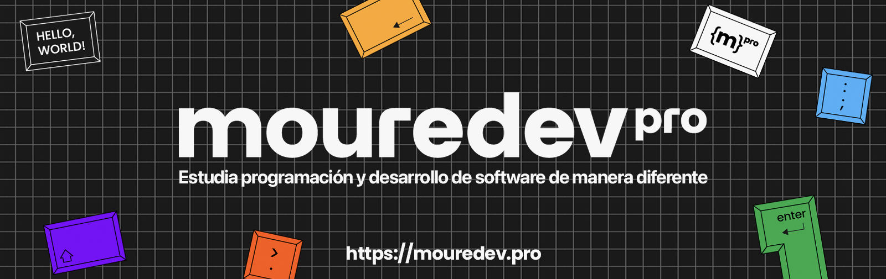

# Roadmap retos de programación 2024

### Ruta de estudio con ejercicios para mejorar tu lógica de programación y aprender cualquier lenguaje. Gratis, a tu ritmo y en comunidad.

#### [https://retosdeprogramacion.com/roadmap](https://retosdeprogramacion.com/roadmap)

## Ranking de lenguajes y usuarios

#### ¿Estás participando en los retos? Ahora puedes consultar el ranking de usuarios y lenguajes según su número de contribuciones.

#### [https://retosdeprogramacion.com/roadmap/ranking](https://retosdeprogramacion.com/roadmap/ranking)

## Información importante

* Puedes utilizar **cualquier lenguaje de programación**, y encontrar tanto mis correcciones como las de la comunidad en el directorio de cada reto.
* **¿Quieres participar?** Te lo explico en la sección **[Instrucciones](https://github.com/mouredev/roadmap-retos-programacion#instrucciones)** en este mismo documento.
* Los retos siguen un orden basado en su ruta de estudio pero si ya tienes conocimientos puedes resolverlos de manera totalmente independiente. Simplemente revisa su nivel de dificultad.

> Consulta la [web](https://retosdeprogramacion.com/roadmap) para más información.

## Roadmap

| # | Ejercicio | Corrección | Vídeo | Comunidad |
|---|-----------|------------|-------|-----------|
|00|[SINTAXIS, VARIABLES, TIPOS DE DATOS Y HOLA MUNDO](./Roadmap/00%20-%20SINTAXIS,%20VARIABLES,%20TIPOS%20DE%20DATOS%20Y%20HOLA%20MUNDO/ejercicio.md)|[📝](./Roadmap/00%20-%20SINTAXIS,%20VARIABLES,%20TIPOS%20DE%20DATOS%20Y%20HOLA%20MUNDO/python/mouredev.py)|[▶️](https://youtu.be/gEIBJ7rmLa0)|[👥](./Roadmap/00%20-%20SINTAXIS,%20VARIABLES,%20TIPOS%20DE%20DATOS%20Y%20HOLA%20MUNDO/)
|01|[OPERADORES Y ESTRUCTURAS DE CONTROL](./Roadmap/01%20-%20OPERADORES%20Y%20ESTRUCTURAS%20DE%20CONTROL/ejercicio.md)|[📝](./Roadmap/01%20-%20OPERADORES%20Y%20ESTRUCTURAS%20DE%20CONTROL/python/mouredev.py)|[▶️](https://youtu.be/DLSGCh9jdes)|[👥](./Roadmap/01%20-%20OPERADORES%20Y%20ESTRUCTURAS%20DE%20CONTROL/)
|02|[FUNCIONES Y ALCANCE](./Roadmap/02%20-%20FUNCIONES%20Y%20ALCANCE/ejercicio.md)|[📝](./Roadmap/02%20-%20FUNCIONES%20Y%20ALCANCE/python/mouredev.py)|[▶️](https://youtu.be/auxClgiX6UM)|[👥](./Roadmap/02%20-%20FUNCIONES%20Y%20ALCANCE/)
|03|[ESTRUCTURAS DE DATOS](./Roadmap/03%20-%20ESTRUCTURAS%20DE%20DATOS/ejercicio.md)|[📝](./Roadmap/03%20-%20ESTRUCTURAS%20DE%20DATOS/python/mouredev.py)|[▶️](https://youtu.be/brxtPtUbU7M)|[👥](./Roadmap/03%20-%20ESTRUCTURAS%20DE%20DATOS/)
|04|[CADENAS DE CARACTERES](./Roadmap/04%20-%20CADENAS%20DE%20CARACTERES/ejercicio.md)|[📝](./Roadmap/04%20-%20CADENAS%20DE%20CARACTERES/python/mouredev.py)|[▶️](https://youtu.be/CKzY7nHwulA)|[👥](./Roadmap/04%20-%20CADENAS%20DE%20CARACTERES/)
|05|[VALOR Y REFERENCIA](./Roadmap/05%20-%20VALOR%20Y%20REFERENCIA/ejercicio.md)|[📝](./Roadmap/05%20-%20VALOR%20Y%20REFERENCIA/python/mouredev.py)|[▶️](https://youtu.be/P2OQDT9Wrb0)|[👥](./Roadmap/05%20-%20VALOR%20Y%20REFERENCIA/)
|06|[RECURSIVIDAD](./Roadmap/06%20-%20RECURSIVIDAD/ejercicio.md)|[📝](./Roadmap/06%20-%20RECURSIVIDAD/python/mouredev.py)|[▶️](https://youtu.be/nTfDkLRrYiM)|[👥](./Roadmap/06%20-%20RECURSIVIDAD/)
|07|[PILAS Y COLAS](./Roadmap/07%20-%20PILAS%20Y%20COLAS/ejercicio.md)|[📝](./Roadmap/07%20-%20PILAS%20Y%20COLAS/python/mouredev.py)|[▶️](https://youtu.be/cBeRWS2X0CA)|[👥](./Roadmap/07%20-%20PILAS%20Y%20COLAS/)
|08|[CLASES](./Roadmap/08%20-%20CLASES/ejercicio.md)|[📝](./Roadmap/08%20-%20CLASES/python/mouredev.py)|[▶️](https://youtu.be/W4tv8WUbum4)|[👥](./Roadmap/08%20-%20CLASES/)
|09|[HERENCIA Y POLIMORFISMO](./Roadmap/09%20-%20HERENCIA/ejercicio.md)|[📝](./Roadmap/09%20-%20HERENCIA/python/mouredev.py)|[▶️](https://youtu.be/PVBs5PWjedA)|[👥](./Roadmap/09%20-%20HERENCIA/)
|10|[EXCEPCIONES](./Roadmap/10%20-%20EXCEPCIONES/ejercicio.md)|[📝](./Roadmap/10%20-%20EXCEPCIONES/python/mouredev.py)|[▶️](https://youtu.be/mfOzfj-BrQo)|[👥](./Roadmap/10%20-%20EXCEPCIONES/)
|11|[MANEJO DE FICHEROS](./Roadmap/11%20-%20MANEJO%20DE%20FICHEROS/ejercicio.md)|[📝](./Roadmap/11%20-%20MANEJO%20DE%20FICHEROS/python/mouredev.py)|[▶️](https://youtu.be/Bsiay2nax4Y)|[👥](./Roadmap/11%20-%20MANEJO%20DE%20FICHEROS/)
|12|[JSON Y XML](./Roadmap/12%20-%20JSON%20Y%20XML/ejercicio.md)|[📝](./Roadmap/12%20-%20JSON%20Y%20XML/python/mouredev.py)|[▶️](https://youtu.be/OwStihBItEg)|[👥](./Roadmap/12%20-%20JSON%20Y%20XML/)
|13|[PRUEBAS UNITARIAS](./Roadmap/13%20-%20PRUEBAS%20UNITARIAS/ejercicio.md)|[📝](./Roadmap/13%20-%20PRUEBAS%20UNITARIAS/python/mouredev.py)|[▶️](https://youtu.be/3WFQ2grp0h0)|[👥](./Roadmap/13%20-%20PRUEBAS%20UNITARIAS/)
|14|[FECHAS](./Roadmap/14%20-%20FECHAS/ejercicio.md)|[📝](./Roadmap/14%20-%20FECHAS/python/mouredev.py)|[▶️](https://youtu.be/EQIAhF7NNMI)|[👥](./Roadmap/14%20-%20FECHAS/)
|15|[ASINCRONÍA](./Roadmap/15%20-%20ASINCRONÍA/ejercicio.md)|[📝](./Roadmap/15%20-%20ASINCRONÍA/python/mouredev.py)|[▶️](https://youtu.be/YA8Ssd3AUwA)|[👥](./Roadmap/15%20-%20ASINCRONÍA/)
|16|[EXPRESIONES REGULARES](./Roadmap/16%20-%20EXPRESIONES%20REGULARES/ejercicio.md)|[📝](./Roadmap/16%20-%20EXPRESIONES%20REGULARES/python/mouredev.py)|[▶️](https://youtu.be/0L7IfEF19ow)|[👥](./Roadmap/16%20-%20EXPRESIONES%20REGULARES/)
|17|[ITERACIONES](./Roadmap/17%20-%20ITERACIONES/ejercicio.md)|[📝](./Roadmap/17%20-%20ITERACIONES/python/mouredev.py)|[▶️](https://youtu.be/X1ROaPH_ci8)|[👥](./Roadmap/17%20-%20ITERACIONES/)
|18|[CONJUNTOS](./Roadmap/18%20-%20CONJUNTOS/ejercicio.md)|[📝](./Roadmap/18%20-%20CONJUNTOS/python/mouredev.py)|[▶️](https://youtu.be/0auuM4GROVA)|[👥](./Roadmap/18%20-%20CONJUNTOS/)
|19|[ENUMERACIONES](./Roadmap/19%20-%20ENUMERACIONES/ejercicio.md)|[📝](./Roadmap/19%20-%20ENUMERACIONES/python/mouredev.py)|[▶️](https://youtu.be/0auuM4GROVA)|[👥](./Roadmap/19%20-%20ENUMERACIONES/)
|20|[PETICIONES HTTP](./Roadmap/20%20-%20PETICIONES%20HTTP/ejercicio.md)|[📝](./Roadmap/20%20-%20PETICIONES%20HTTP/python/mouredev.py)|[▶️](https://youtu.be/-pYMoPYSkgM)|[👥](./Roadmap/20%20-%20PETICIONES%20HTTP/)
|21|[CALLBACKS](./Roadmap/21%20-%20CALLBACKS/ejercicio.md)|[📝](./Roadmap/21%20-%20CALLBACKS/python/mouredev.py)|[▶️](https://youtu.be/tqQo9SjJFlY)|[👥](./Roadmap/21%20-%20CALLBACKS/)
|22|[FUNCIONES DE ORDEN SUPERIOR](./Roadmap/22%20-%20FUNCIONES%20DE%20ORDEN%20SUPERIOR/ejercicio.md)|[📝](./Roadmap/22%20-%20FUNCIONES%20DE%20ORDEN%20SUPERIOR/python/mouredev.py)|[▶️](https://youtu.be/ABniGtbqAXk)|[👥](./Roadmap/22%20-%20FUNCIONES%20DE%20ORDEN%20SUPERIOR/)
|23|[SINGLETON](./Roadmap/23%20-%20SINGLETON/ejercicio.md)|[📝](./Roadmap/23%20-%20SINGLETON/python/mouredev.py)|[▶️](https://youtu.be/cOIcFo_w9hA)|[👥](./Roadmap/23%20-%20SINGLETON/)
|24|[DECORADORES](./Roadmap/24%20-%20DECORADORES/ejercicio.md)|[📝](./Roadmap/24%20-%20DECORADORES/python/mouredev.py)|[▶️](https://youtu.be/jxJOjg7gPG4)|[👥](./Roadmap/24%20-%20DECORADORES/)
|25|[LOGS](./Roadmap/25%20-%20LOGS/ejercicio.md)|[📝](./Roadmap/25%20-%20LOGS/python/mouredev.py)|[▶️](https://youtu.be/y2O6L1r_skc)|[👥](./Roadmap/25%20-%20LOGS/)
|26|[SOLID: PRINCIPIO DE RESPONSABILIDAD ÚNICA](./Roadmap/26%20-%20SOLID%20SRP/ejercicio.md)|[📝](./Roadmap/26%20-%20SOLID%20SRP/python/mouredev.py)|[▶️](https://youtu.be/7NM8FK9G91M)|[👥](./Roadmap/26%20-%20SOLID%20SRP)
|27|[SOLID: PRINCIPIO ABIERTO-CERRADO](./Roadmap/27%20-%20SOLID%20OCP/ejercicio.md)|[📝](./Roadmap/27%20-%20SOLID%20OCP/python/mouredev.py)|[▶️](https://youtu.be/o0lSVzu4ur4)|[👥](./Roadmap/27%20-%20SOLID%20OCP/)
|28|[SOLID: PRINCIPIO DE SUSTITUCIÓN DE LISKOV](./Roadmap/28%20-%20SOLID%20LSP/ejercicio.md)|[📝](./Roadmap/28%20-%20SOLID%20LSP/python/mouredev.py)|[▶️](https://youtu.be/SgHoiF1KLTo)|[👥](./Roadmap/28%20-%20SOLID%20LSP/)
|29|[SOLID: PRINCIPIO DE SEGREGACIÓN DE INTERFACES](./Roadmap/29%20-%20SOLID%20ISP/ejercicio.md)|[📝](./Roadmap/29%20-%20SOLID%20ISP/python/mouredev.py)|[▶️](https://youtu.be/0zTmCTHJ_lg)|[👥](./Roadmap/29%20-%20SOLID%20ISP/)
|30|[SOLID: PRINCIPIO DE INVERSIÓN DE DEPENDENCIAS](./Roadmap/30%20-%20SOLID%20DIP/ejercicio.md)|[📝](./Roadmap/30%20-%20SOLID%20DIP/python/mouredev.py)|[▶️](https://youtu.be/wxIj6Rs8rAU)|[👥](./Roadmap/30%20-%20SOLID%20DIP/)
|31|[SIMULADOR JUEGOS OLÍMPICOS](./Roadmap/31%20-%20SIMULADOR%20JUEGOS%20OLÍMPICOS/ejercicio.md)|[📝](./Roadmap/31%20-%20SIMULADOR%20JUEGOS%20OLÍMPICOS/python/mouredev.py)|[▶️](https://youtu.be/JN656lQ9WBo)|[👥](./Roadmap/31%20-%20SIMULADOR%20JUEGOS%20OLÍMPICOS/)
|32|[BATALLA DEADPOOL Y WOLVERINE](./Roadmap/32%20-%20BATALLA%20DEADPOOL%20Y%20WOLVERINE/ejercicio.md)|[📝](./Roadmap/32%20-%20BATALLA%20DEADPOOL%20Y%20WOLVERINE/python/mouredev.py)|[▶️](https://youtu.be/u2Tn2H3pqjw)|[👥](./Roadmap/32%20-%20BATALLA%20DEADPOOL%20Y%20WOLVERINE/)
|33|[RESCATANDO A MICKEY](./Roadmap/33%20-%20RESCATANDO%20A%20MICKEY/ejercicio.md)|[📝](./Roadmap/33%20-%20RESCATANDO%20A%20MICKEY/python/mouredev.py)|[▶️](https://youtu.be/Bo9Cp3N68C0)|[👥](./Roadmap/33%20-%20RESCATANDO%20A%20MICKEY/)
|34|[ÁRBOL GENEALÓGICO DE LA CASA DEL DRAGÓN](./Roadmap/34%20-%20ÁRBOL%20GENEALÓGICO%20LA%20CASA%20DEL%20DRAGÓN/ejercicio.md)|[📝](./Roadmap/34%20-%20ÁRBOL%20GENEALÓGICO%20LA%20CASA%20DEL%20DRAGÓN/python/mouredev.py)|[▶️](https://youtu.be/GAHBOAzgE2w)|[👥](./Roadmap/34%20-%20ÁRBOL%20GENEALÓGICO%20LA%20CASA%20DEL%20DRAGÓN/)
|35|[REPARTIENDO LOS ANILLOS DE PODER](./Roadmap/35%20-%20REPARTIENDO%20LOS%20ANILLOS%20DE%20PODER/ejercicio.md)|[📝](./Roadmap/35%20-%20REPARTIENDO%20LOS%20ANILLOS%20DE%20PODER/python/mouredev.py)|[▶️](https://youtu.be/10i2dnaMLj8)|[👥](./Roadmap/35%20-%20REPARTIENDO%20LOS%20ANILLOS%20DE%20PODER/)
|36|[EL SOMBRERO SELECCIONADOR](./Roadmap/36%20-%20EL%20SOMBRERO%20SELECCIONADOR/ejercicio.md)|[📝](./Roadmap/36%20-%20EL%20SOMBRERO%20SELECCIONADOR/python/mouredev.py)|[▶️](https://youtu.be/_UjOD587elY)|[👥](./Roadmap/36%20-%20EL%20SOMBRERO%20SELECCIONADOR/)
|37|[OASIS VS LINKIN PARK](./Roadmap/37%20-%20OASIS%20VS%20LINKIN%20PARK/ejercicio.md)|[📝](./Roadmap/37%20-%20OASIS%20VS%20LINKIN%20PARK/python/mouredev.py)|[▶️](https://youtu.be/q-zBKriHupY)|[👥](./Roadmap/37%20-%20OASIS%20VS%20LINKIN%20PARK/)
|38|[MOUREDEV PRO](./Roadmap/38%20-%20MOUREDEV%20PRO/ejercicio.md)|[📝](./Roadmap/38%20-%20MOUREDEV%20PRO/python/mouredev.py)|[▶️](https://youtu.be/AbGROLoAVLs)|[👥](./Roadmap/38%20-%20MOUREDEV%20PRO/)
|39|[BATMAN DAY](./Roadmap/39%20-%20BATMAN%20DAY/ejercicio.md)|[📝](./Roadmap/39%20-%20BATMAN%20DAY/python/mouredev.py)|[▶️](https://youtu.be/Lmj5enZG5pg)|[👥](./Roadmap/39%20-%20BATMAN%20DAY/)
|40|[FORTNITE RUBIUS CUP](./Roadmap/40%20-%20FORTNITE%20RUBIUS%20CUP/ejercicio.md)|[📝](./Roadmap/40%20-%20FORTNITE%20RUBIUS%20CUP/python/mouredev.py)|[▶️](https://youtu.be/UlWtFvLLSXw)|[👥](./Roadmap/40%20-%20FORTNITE%20RUBIUS%20CUP/)
|41|[CAMISETA RAR](./Roadmap/41%20-%20CAMISETA%20RAR/ejercicio.md)|[📝](./Roadmap/41%20-%20CAMISETA%20RAR/python/mouredev.py)|[▶️](https://youtu.be/QXFrWIFCkGY)|[👥](./Roadmap/41%20-%20CAMISETA%20RAR/)
|42|[TORNEO DRAGON BALL](./Roadmap/42%20-%20TORNEO%20DRAGON%20BALL/ejercicio.md)|[📝](./Roadmap/42%20-%20TORNEO%20DRAGON%20BALL/python/mouredev.py)|[▶️](https://youtu.be/SgwX7ISEkvM)|[👥](./Roadmap/42%20-%20TORNEO%20DRAGON%20BALL/)
|43|[GIT GITHUB CLI](./Roadmap/43%20-%20GIT%20GITHUB%20CLI/ejercicio.md)|[📝](./Roadmap/43%20-%20GIT%20GITHUB%20CLI/python/mouredev.py)|[▶️](https://youtu.be/Ct4GKpbqflI)|[👥](./Roadmap/43%20-%20GIT%20GITHUB%20CLI/)
|44|[CUENTA ATRÁS MOUREDEV PRO](./Roadmap/44%20-%20CUENTA%20ATRÁS%20MOUREDEV%20PRO/ejercicio.md)|[📝](./Roadmap/44%20-%20CUENTA%20ATRÁS%20MOUREDEV%20PRO/python/mouredev.py)|[▶️](https://youtu.be/9wsXz4K8Q-4)|[👥](./Roadmap/44%20-%20CUENTA%20ATRÁS%20MOUREDEV%20PRO/)
|45|[GITHUB OCTOVERSE](./Roadmap/45%20-%20GITHUB%20OCTOVERSE/ejercicio.md)|[📝](./Roadmap/45%20-%20GITHUB%20OCTOVERSE/python/mouredev.py)|[▶️](https://youtu.be/yj5ZFT_Xmcs)|[👥](./Roadmap/45%20-%20GITHUB%20OCTOVERSE/)
|46|[X VS BLUESKY](./Roadmap/46%20-%20X%20VS%20BLUESKY/ejercicio.md)|[📝](./Roadmap/46%20-%20X%20VS%20BLUESKY/python/mouredev.py)|[▶️](https://youtu.be/RzwFGihKpOM)|[👥](./Roadmap/46%20-%20X%20VS%20BLUESKY/)
|47|[CALENDARIO DE ADVIENTO](./Roadmap/47%20-%20CALENDARIO%20DE%20ADVIENTO/ejercicio.md)|[📝](./Roadmap/47%20-%20CALENDARIO%20DE%20ADVIENTO/python/mouredev.py)|[▶️](https://youtu.be/LteI1J5gmZw)|[👥](./Roadmap/47%20-%20CALENDARIO%20DE%20ADVIENTO/)
|48|[ÁRBOL DE NAVIDAD](./Roadmap/48%20-%20ÁRBOL%20DE%20NAVIDAD/ejercicio.md)|[📝](./Roadmap/48%20-%20ÁRBOL%20DE%20NAVIDAD/python/mouredev.py)|[▶️](https://youtu.be/bIguZe3iXVo)|[👥](./Roadmap/48%20-%20ÁRBOL%20DE%20NAVIDAD/)
|49|[EL ALMACÉN DE PAPÁ NOEL](./Roadmap/49%20-%20EL%20ALMACÉN%20DE%20PAPÁ%20NOEL/ejercicio.md)|[📝](./Roadmap/49%20-%20EL%20ALMACÉN%20DE%20PAPÁ%20NOEL/python/mouredev.py)|[▶️](https://youtu.be/XGMxosQArxw)|[👥](./Roadmap/49%20-%20EL%20ALMACÉN%20DE%20PAPÁ%20NOEL/)
|50|[PLANIFICADOR DE OBJETIVOS DE AÑO NUEVO](./Roadmap/50%20-%20PLANIFICADOR%20DE%20OBJETIVOS%20DE%20A%C3%91O%20NUEVO/ejercicio.md)|[📝](./Roadmap/50%20-%20PLANIFICADOR%20DE%20OBJETIVOS%20DE%20A%C3%91O%20NUEVO/python/mouredev.py)|[▶️](https://youtu.be/MmHSEcWlSbk)|[👥](./Roadmap/50%20-%20PLANIFICADOR%20DE%20OBJETIVOS%20DE%20A%C3%91O%20NUEVO/)

## Cursos en YouTube

A media que avanzamos en el roadmap estoy creando cursos que agrupan las clases.

## Instrucciones

**Haz un [FORK](https://github.com/mouredev/roadmap-retos-programacion/fork) del proyecto y trabaja con Git para ir sincronizando las actualizaciones.**

1. En el proyecto tienes un directorio para cada ejercicio en la carpeta [Roadmap](./Roadmap). Dentro de cada directorio encontrarás un fichero llamado **ejercicio.md** con el enunciado de cada reto.
2. Si quieres compartir tu propia solución de un ejercicio con la comunidad, crea un fichero de código con tu nombre y extensión, y realiza una [**PULL REQUEST**](https://docs.github.com/es/pull-requests/collaborating-with-pull-requests/proposing-changes-to-your-work-with-pull-requests/creating-a-pull-request) contra el repositorio.
3. El fichero de código debe situarse dentro del directorio del reto, en la carpeta correspondiente al lenguaje de programación utilizado (si no existe la carpeta del lenguaje, créala con todas sus letras en minúsculas). Por ejemplo, si has resuelto el reto #00 utilizando el lenguaje de programación Python y tu usuario de GitHub se llama "mouredev", tu corrección deberá estar en **"Roadmap/00 - SINTAXIS, VARIABLES, TIPOS DE DATOS Y HOLA MUNDO/python/mouredev.py"**. El título de la Pull Request también debe seguir este formato: **"#[número] - [lenguaje_utilizado]"**. En el ejemplo anterior sería **"#00 - Python"**. Se rechazarán las Pull Request que no sigan este formato o contengan ficheros adicionales.
4. Si necesitas ayuda o quieres comentar cualquier cosa sobre los retos, tienes el canal "ejercicios-logica” en nuestro servidor de **[Discord](https://discord.gg/mouredev)**.
5. Puedes proponer Pull Request con propuestas o correcciones sobre ejercicios del resto de la comunidad si estos poseen errores. De esta manera colaboraremos para crear un repositorio cada vez más valioso.
6. Si se te solicita un cambio/corrección en una Pull Request, y al cabo de 2 semanas no se muestra nueva actividad, se cerrará esa petición para mantener el repositorio limpio. Por supuesto, puedes volver a enviar la Pull Request cuando quieras.

## Aclaraciones

Si tienes dudas con el nombre del directorio de algún lenguaje, intenta consultar el nombre que se ha empleado en ejercicios anteriores. Algunos ejemplos que puedes llegar a dudar:
    
* c#, no csharp
* c++, no cplusplus
* go, no golang
* javascript, no js

## Guía rápida Git y GitHub

1. Realiza un [FORK](https://github.com/mouredev/roadmap-retos-programacion/fork) del repositorio de retos desde GitHub.
2. CLONA ese repositorio a tu máquina local `git clone [TU-REPOSITORIO]`.
3. (Opcional) Crea una RAMA para la solución y desplázate a ella `git checkout -b [EL-NOMBRE-DE-TU-RAMA]`.
4. Añade el fichero de tu solución al STAGE `git add [FICHERO-DE-TU-RETO]`.
5. Haz COMMIT con el mensaje de la solución `git commit -m "#[NÚMERO-RETO] - [LENGUAJE-UTILIZADO]"`.
6. Haz PUSH `git push [EL-NOMBRE-DE-TU-RAMA]` (puede ser la "main" o la que creaste en el paso 3)
7. En el repositorio principal debes ir a la rama y hacer [PULL REQUEST](https://docs.github.com/es/pull-requests/collaborating-with-pull-requests/proposing-changes-to-your-work-with-pull-requests/creating-a-pull-request).
8. CONTRIBUTE.
9. CREATE PULL REQUEST (cubre la plantilla que te aparecerá).
10. Si el proceso de entrega se ha realizado de forma correcta, se añadirá tu corrección al repositorio. En caso contrario, se te notificarán los cambios a realizar o los motivos del rechazo.

*He creado un curso completo gratis para aprender a trabajar con Git y GitHub desde cero.*

## Más retos de programación

**Consulta los 101 retos de programación resueltos y las 12 aplicaciones para tu portfolio que ya hemos desarrollado.**

## Únete al campus de programación de la comunidad

#### Te presento [mouredev pro](https://mouredev.pro), mi proyecto más importante para ayudarte a estudiar programación y desarrollo de software de manera diferente.

> **¿Buscas un extra?** Aquí encontrarás mis cursos editados por lecciones individuales, para avanzar a tu ritmo y guardar el progreso. También dispondrás de ejercicios y correcciones, test para validar tus conocimientos, examen y certificado público de finalización, soporte, foro de estudiantes, reunionnes grupales, cursos exclusivos y mucho más.
> 
> Entra en **[mouredev.pro](https://mouredev.pro)** y utiliza el cupón **"PRO"** con un 10% de descuento en tu primera suscripción.

##  Hola, mi nombre es Brais Moure.
### Freelance full-stack iOS & Android engineer

Soy ingeniero de software desde 2010. Desde 2018 combino mi trabajo desarrollando Apps con la creación de contenido formativo sobre programación y tecnología en diferentes redes sociales como **[@mouredev](https://moure.dev)**.

Si quieres unirte a nuestra comunidad de desarrollo, aprender programación, mejorar tus habilidades y ayudar a la continuidad del proyecto, puedes encontrarnos en:

 
 

## 🌐 Web Resources & Interactive Index
- [BRAINROT CLICK TO HATCH](https://themindquestpark-ja.pages.dev/brainrot-click-to-hatch.html)
- [ITALIAN BRAINROT FIND THE STARS](https://quizzesarena.onrender.com/italian-brainrot-find-the-stars.html)
- [DTA 2 MANIAC](https://thelearnquests9.pages.dev/dta-2-maniac.html)
- [KING OF CRABS](https://eduquests.netlify.app/king-of-crabs.html)
- [INDEX8](https://learninglab-hi.pages.dev/index8.html)
- [CAR PARKING MASTER 3D REAL DRIVING SIMULATOR](https://edulab-en.pages.dev/car-parking-master-3d-real-driving-simulator.html)
- [MAHJONG ZEN GARDEN](https://braingames-ko.pages.dev/mahjong-zen-garden.html)
- [CRAZY TUNNEL](https://eduquestspt.pages.dev/crazy-tunnel.html)
- [ROBBIE STAND ON THE RIGHT COLOR](https://braingames-ko.pages.dev/robbie-stand-on-the-right-color.html)
- [DINO SURVIVAL 3D SIMULATOR](https://learninggames-fr.pages.dev/dino-survival-3d-simulator.html)
- [EXTREME CAR RACE MASTER 3D](https://braingames-ko.pages.dev/extreme-car-race-master-3d.html)
- [PARKING MASTER URBAN CHALLENGES](https://eduquests.onrender.com/parking-master-urban-challenges.html)
- [TARCAT](https://mindgames-hi.pages.dev/tarcat.html)
- [FLOWER COLLECTION](https://eduquests.onrender.com/flower-collection.html)
- [THUMBPINBALL](https://eduquestses.pages.dev/thumbpinball.html)
- [MICROPLASTICS FEEDING](https://eduquestspt.pages.dev/microplastics-feeding.html)
- [CATEGORY STRATEGY](https://mindgames-hi.pages.dev/category-strategy.html)
- [CATEGORY HORROR 2](https://learninggames-fr.pages.dev/category-horror-2.html)
- [CATEGORY EDUCATIONAL25](https://skillclass-pt.pages.dev/category-educational25.html)
- [BLOCK PIXELS](https://ieduquests.web.app/block-pixels.html)
- [MEME MUKBANG ASMR GAME](https://ieduquests.web.app/meme-mukbang-asmr-game.html)
- [CLEAN THE FLOOR](https://knowledgegames-en.pages.dev/clean-the-floor.html)
- [CATEGORY MONSTER](https://knowledgegames-en.pages.dev/category-monster.html)
- [BFFS LUXURY LOUNGEWEAR](https://mindconvertes.pages.dev/bffs-luxury-loungewear.html)
- [MINE SLASH](https://themindconvert.web.app/mine-slash.html)
- [BACKGAMMON DUEL](https://skillclass-pt.pages.dev/backgammon-duel.html)
- [ARROW COUNT MASTER](https://studylab-zh.pages.dev/arrow-count-master.html)
- [INDEX20](https://mindconvert.netlify.app/index20.html)
- [CATEGORY TETRIS](https://brainquesteses.pages.dev/category-tetris.html)
- [UNBLOCK IT ATLANTIS](https://eduquests.netlify.app/unblock-it-atlantis.html)
- [EMOJI SORT FUN PUZZLE GAME](https://thebrainquests9.pages.dev/emoji-sort-fun-puzzle-game.html)
- [CATEGORY RAMMERHEAD](https://eduquestses.pages.dev/category-rammerhead.html)
- [CATEGORY 3 PLAYER26](https://jangkhangkr.pages.dev/category-3-player26.html)
- [WINTER COSMOFEST](https://brainquests.pages.dev/winter-cosmofest.html)
- [TRUCK STACK COLORS](https://brainquestsjp.pages.dev/truck-stack-colors.html)
- [WOODEN BOLTS AND NUTS](https://knowledgegames-en.pages.dev/wooden-bolts-and-nuts.html)
- [COLOR BUMP DANCER](https://brainquestsfr.pages.dev/color-bump-dancer.html)
- [BLOCK BREAKER](https://studygames-ru.pages.dev/block-breaker.html)
- [PIRATES MAHJONG](https://mindconvertfr.pages.dev/pirates-mahjong.html)
- [SUPER DOG HERO DASH](https://mindlab-es.pages.dev/super-dog-hero-dash.html)
- [SPIDER BUBU](https://studygames-ru.pages.dev/spider-bubu.html)
- [SLIDE THEM AWAY](https://mindgames-hi.pages.dev/slide-them-away.html)
- [INDEX6](https://edugames-ja.pages.dev/index6.html)
- [MATCH ARENA](https://eduquestspt.pages.dev/match-arena.html)
- [CONSTRUCTION TRUCK BUILDING GAMES FOR KIDS](https://knowledgeclass-fr.pages.dev/construction-truck-building-games-for-kids.html)
- [CATEGORY ONE BUTTON](https://edugames-ja.pages.dev/category-one-button.html)
- [RACE IT CAR RACING](https://theplayandlearns9.pages.dev/race-it-car-racing.html)
- [SHANGHAI CHEF](https://learninggames-fr.pages.dev/shanghai-chef.html)
- [CATEGORY FASHION105](https://mindconvert.netlify.app/category-fashion105.html)
- [CATEGORY STICKMAN 3](https://jangkhangkr.pages.dev/category-stickman-3.html)
- [HERO TOWER WAR](https://eduquestsjp.pages.dev/hero-tower-war.html)
- [BUS JAM ESCAPE](https://eduquests.pages.dev/bus-jam-escape.html)
- [LITTLE HERO KNIGHT](https://edugames-ja.pages.dev/little-hero-knight.html)
- [WARFRONT](https://knowledgeclass-fr.pages.dev/warfront.html)
- [MAHJONG 3D MATCH](https://mindgames-hi.pages.dev/mahjong-3d-match.html)
- [SNOWBOARD GAME PARTY](https://brainquestsjp.pages.dev/snowboard-game-party.html)
- [HEXAFILL](https://thestudyquests9.pages.dev/hexafill.html)
- [ROBBOTTO](https://thestudyquests9.pages.dev/robbotto.html)
- [MOSCOW METRO DRIVER 3D](https://knowledgelab-fr.pages.dev/moscow-metro-driver-3d.html)
- [CATEGORY FPS 2](https://learninggames-fr.pages.dev/category-fps-2.html)
- [SKATING PARK](https://themindconvert.web.app/skating-park.html)
- [CATEGORY MOUSE1 697](https://learninggames-fr.pages.dev/category-mouse1-697.html)
- [CATEGORY CAR 2](https://smartlab-ru.pages.dev/category-car-2.html)
- [ISLAND EXPANDER](https://learninggames-fr.pages.dev/island-expander.html)
- [MINIGIANTS IO](https://brainclass-vi.pages.dev/minigiants-io.html)
- [BROTHERFOLLOW ME MERGE MEN](https://brainquesteses.pages.dev/brotherfollow-me-merge-men.html)
- [CATEGORY ANIMAL216](https://skillclass-pt.pages.dev/category-animal216.html)
- [CINEMA EMPIRE IDLE TYCOON](https://mindconvert.pages.dev/cinema-empire-idle-tycoon.html)
- [2 3 4 PLAYER GAMES](https://jangkhangkr.pages.dev/2-3-4-player-games.html)
- [JUICE MERGE](https://knowledgelab-fr.pages.dev/juice-merge.html)
- [REFLECT BEAM LASER LOGIC](https://knowledgegames-en.pages.dev/reflect-beam-laser-logic.html)
- [SNIPER MASTER](https://brainquests.pages.dev/sniper-master.html)
- [CATEGORY CONTROLLER59](https://learninggames-fr.pages.dev/category-controller59.html)
- [WORD CLASH](https://learninggames-fr.pages.dev/word-clash.html)
- [XIBLBA MATCH](https://thestudyquests9.pages.dev/xiblba-match.html)
- [GIANT RUN 3D](https://eduquestkr.pages.dev/giant-run-3d.html)
- [SUDOKU GARDEN](https://studygames-ru.pages.dev/sudoku-garden.html)
- [INDEX10](https://mindconvert.netlify.app/index10.html)
- [CHICKEN STRIKE](https://jangkhangkr.pages.dev/chicken-strike.html)
- [SNAKE KING](https://thebrainquests9.pages.dev/snake-king.html)
- [CATEGORY AGILITY](https://knowledgeclass-fr.pages.dev/category-agility.html)
- [TINY FOOTBALL CUP 2026](https://smartlab-ru.pages.dev/tiny-football-cup-2026.html)
- [INDEX28](https://mindconvert.pages.dev/index28.html)
- [CATEGORY 3D1 371](https://mindconvert.netlify.app/category-3d1-371.html)
- [ROBOT BAND FIND THE DIFFERENCES](https://mindconvertfr.pages.dev/robot-band-find-the-differences.html)
- [DIG OUT OF PRISON](https://mindconvert.pages.dev/dig-out-of-prison.html)
- [PARKOUR BLOCK 6](https://studygames-ru.pages.dev/parkour-block-6.html)
- [TATTOO MASTER](https://eduquests.netlify.app/tattoo-master.html)
- [SHAPE SHIFT](https://knowledgelab-fr.pages.dev/shape-shift.html)
- [CATEGORY DRESS UP](https://learninggames-fr.pages.dev/category-dress-up.html)
- [CUT THE GRASS 3D](https://theplayandlearns9.pages.dev/cut-the-grass-3d.html)
- [EPIC MINE](https://brainclass-vi.pages.dev/epic-mine.html)
- [CATEGORY DOG18](https://learninggames-fr.pages.dev/category-dog18.html)
- [POTION MERGE WITCH](https://skillclass-pt.pages.dev/potion-merge-witch.html)
- [PRIVACY](https://cryptotify9.onrender.com/privacy.html)
- [CATEGORY FPS GAMES](https://mindclass-es.pages.dev/category-fps-games.html)
- [CATEGORY CASUAL 2](https://mindconvert.netlify.app/category-casual-2.html)
- [VEGAMIX MATCH 3 VILLAGE](https://mindconvert.pages.dev/vegamix-match-3-village.html)
- [CATEGORY COLLECT565](https://learninggames-fr.pages.dev/category-collect565.html)
- [HYPERSPACE   QUANTUM FRACTURE FEZ](https://edugames-ja.pages.dev/hyperspace---quantum-fracture-fez.html)
- [PET SALON 2](https://mindconvert.pages.dev/pet-salon-2.html)
- [BOXING FIGHTER](https://knowledgelab-fr.pages.dev/boxing-fighter.html)
- [CATEGORY MAKEUP](https://eduquestses.pages.dev/category-makeup.html)
- [ZOMBIE REDEMPTION](https://thebrainquests9.pages.dev/zombie-redemption.html)
- [FARMING LIFE](https://knowledgelab-fr.pages.dev/farming-life.html)
- [EMERGENCY JAM](https://skillclass-pt.pages.dev/emergency-jam.html)
- [ITALIAN BRAINROT SURVIVE PARKOUR](https://eduquestsjp.pages.dev/italian-brainrot-survive-parkour.html)
- [DOWNHILL CAR RIDE CRASH TEST](https://mindconvertfr.pages.dev/downhill-car-ride-crash-test.html)
- [SCREW COLOR SORTING MASTER](https://skillclass-pt.pages.dev/screw-color-sorting-master.html)
- [TANK STARS BATTLE ARENA](https://knowledgegames-en.pages.dev/tank-stars-battle-arena.html)
- [CATEGORY BUBBLE SHOOTER](https://studygames-ru.pages.dev/category-bubble-shooter.html)
- [KIDS SUPERMARKET](https://jangkhangkr.pages.dev/kids-supermarket.html)
- [CATEGORY HAIR](https://knowledgegames-en.pages.dev/category-hair.html)
- [CATEGORY ARENA255](https://smartclass-ru.pages.dev/category-arena255.html)
- [NUMBER MERGE 10](https://jangkhangkr.pages.dev/number-merge-10.html)
- [MAKE TEN TILES](https://mindgames-hi.pages.dev/make-ten-tiles.html)
- [SLOPE SPOOKY](https://brainclass-vi.pages.dev/slope-spooky.html)
- [GALAXY CARNAGE](https://eduquestsjp.pages.dev/galaxy-carnage.html)
- [CATEGORY CARDS](https://learnplay-pt.pages.dev/category-cards.html)
- [LURKERS IO](https://eduworld-ru.pages.dev/lurkers-io.html)
- [ARROWTIX TRAIN YOUR BRAIN](https://knowledgelab-fr.pages.dev/arrowtix-train-your-brain.html)
- [MY HOSPITAL LEARN CARE](https://theplayandlearns9.pages.dev/my-hospital-learn-care.html)
- [CATEGORY GUN238](https://learninggames-fr.pages.dev/category-gun238.html)
- [CATEGORY PUZZLE](https://learninggames-fr.pages.dev/category-puzzle.html)
- [JAILBREAK ASSAULT](https://brainclass-vi.pages.dev/jailbreak-assault.html)
- [CATCH THE GOOSE](https://jangkhangkr.pages.dev/catch-the-goose.html)
- [GT FORMULA CHAMPIONSHIP](https://brainlab-vi.pages.dev/gt-formula-championship.html)
- [GEAR WARS](https://jangkhangkr.pages.dev/gear-wars.html)
- [CONNECT BALLS NEW YEAR PUZZLES](https://playandlearn-fr.pages.dev/connect-balls-new-year-puzzles.html)
- [CATEGORY MATCH 3117](https://mindconvert.pages.dev/category-match-3117.html)
